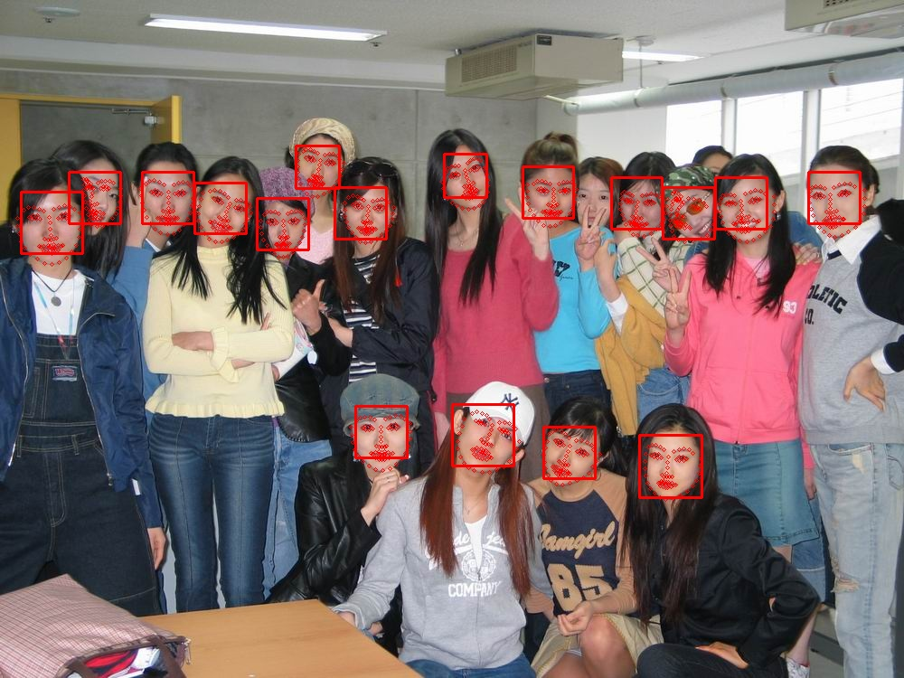
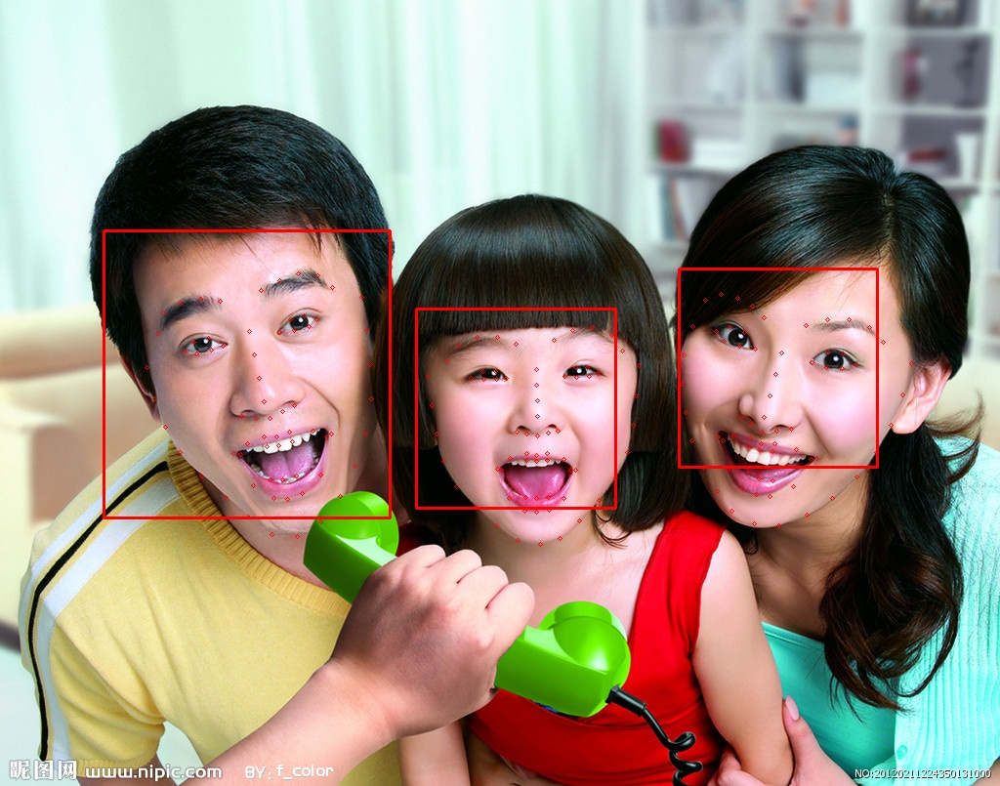
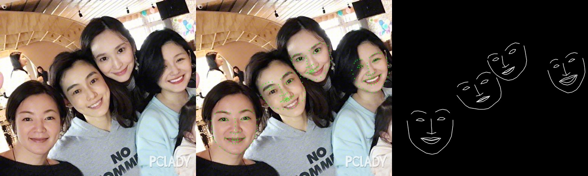
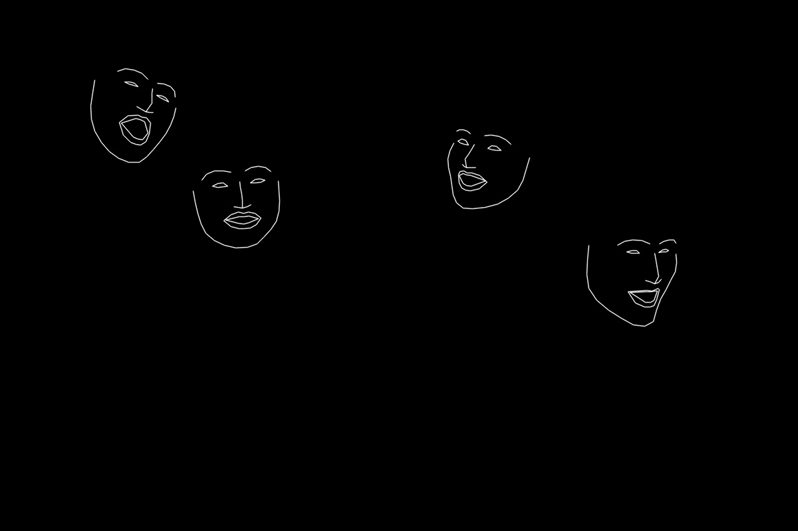

68 Facial Landmarks Shape Predictor(Easy Use)
===============
This repo aims at shortening your developing time in face detection and alignment. 


I use [dlib](http://dlib.net/) to perform face detection and landmarks regression, and you can refer to <https://github.com/codeniko/shape_predictor_81_face_landmarks> for 81 face landmarks detection.


### Prepare Dlib model(official release)

Please download the pre-trained model from [shape_predictor_68_face_landmarks.dat](<http://sourceforge.net/projects/dclib/files/dlib/v18.10/shape_predictor_68_face_landmarks.dat.bz2>) and extract it to `dlibmodels` directory.


### Requirements

```shell
opencv-python>=3.2.0
dlib>=19.14.0
numpy
```


### Usage

In this work, a easy-use face detector is build. refer to `dlibpp.py`. To detect from a image, just run:

```python
fd = dlibpp.DLIBPP()
box, landmarks = fd.detect_faces(img)
```


### Example code

```python
from dlibpp import DLIBPP
import cv2
import mask

fd = DLBPP()
img = cv2.imread('example.png')
box, landmarks = fd.detect_faces(img)
linemask = np.zeros_like(img).astype(np.uint8)

for landmarks_i in landmarks:
    for (x,y) in landmarks_i:
        img = cv2.circle(img, (x, y), 1, (0,255,0), 1)
	linemask = mask.generate_line_mask(linemask, landmarks_i)
example = np.hstack([img, linemask])
cv2.imshow('example', example)
cv2.waitKey(0)
cv2.destroyAllWindows()
```


## Examples












### Acknowledgement

* Thanks for open source code from [Dlib]()
* Thanks for [codeniko](https://github.com/codeniko/shape_predictor_81_face_landmarks) for his fantastic 81 landmarks alignment work.

Thanks for your interest in this repo. If you work or research benefit from this repo, please cite it , start it and popularize it 😃
